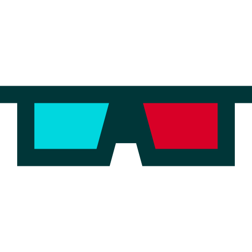

### Lazy Eye Reader for Amblyopia !  

### Overview 
Amblyopia is a vision development disorder in which an eye fails to achieve normal visual acuity due to the eye and the brain not working together properly.

### Treatment 
In the majority of cases, amblyopia can be treated at any age with a combination of corrective lenses and vision therapy.  Treatment can lead to improved quality of life that goes beyond seeing better.

### Creating an effective tool for adult vision therapy

**Limitations of existing bar readers:**
* Red/green bar reader sheets are used with 3D anaglyph glasses encourages the patient’s eyes to work together.  These are usually acetate sheets that are either pre-printed or homemade.  The opacity is obviously not easily adjustable.
* Existing bar reader programs are limited because they either only work in a browser window or require text files as input.

**The goal of this project is to create:**

A vision therapy tool that adult patients can use for extended periods of computer time;
an adjustable bar reader filter that can be used over the entire computer screen;
a tool that allows the patient to use their computer for a variety of tasks not just reading. 

**Lazy Eye Filter Overview** 
* Red/Green Screen Reading Filter (AKA Lazy Eye Reader) is an application which puts a striped filter over the screen to simulate a bar reader.
* The Red/Green Screen Reading Filter allows the user to view anything on the screen and manipulate the windows as the user normally would.  
* The filter controls can be brought to the foreground to adjust the opacity of the red and green bars.  
* In  configuring the bar reader for the patient’s use, the opacity must be adjusted so that the bars appear completely opaque when looking through the filter of the opposite color with the anaglyph glasses.  
* This produces the maximum benefit when looking through the red/green filter at the same time.  
* The functional eye is suppressed to a level that allows the weaker eye the opportunity to focus.

### Preview

Includes **Shady** code by **Matt Gemmell**
